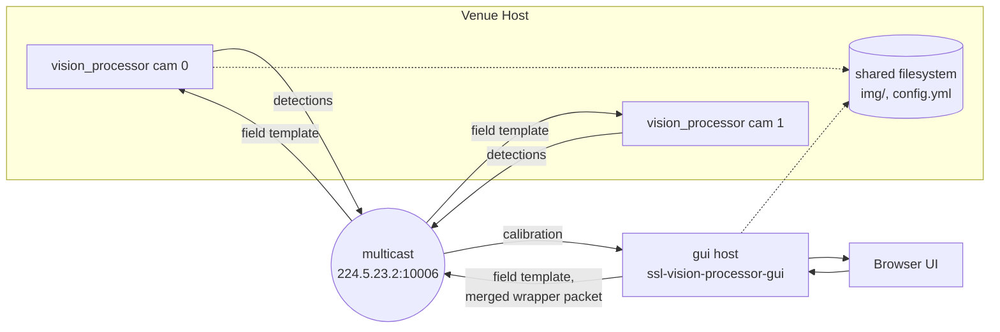
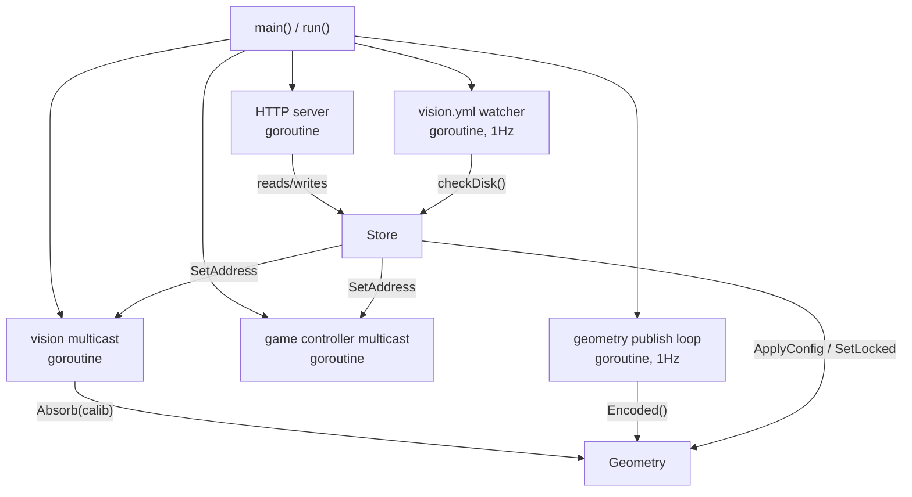
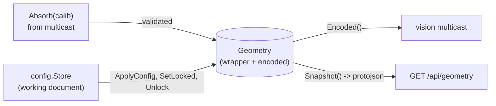
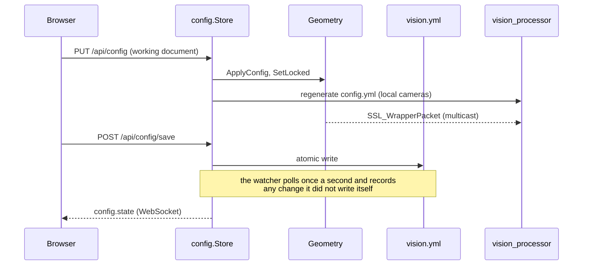

# gui Architecture

This document describes the design of `gui`, the Go host and browser UI for vision_processor. It covers the
subsystem in this directory only. The C++ vision_processor and the Python scripts in `python/` are described in
the root README and are not modified by this subsystem.

`gui` replaces `python/geom_publisher.py` for anyone running it. It is a single Go binary with an embedded
Svelte frontend. It owns the shared field geometry, absorbs camera calibrations from vision_processor instances
over multicast, and serves the frontend, a JSON API, and a WebSocket for live updates, all on one port.

## System overview

A venue runs one or more vision_processor instances, one per camera. Each instance shares a filesystem with the
gui host (debug images in `img/`, the instance's generated `config.yml`) and exchanges SSL vision protocol messages
with it over the same multicast group the rest of the league uses.



The gui host does not talk to a vision_processor instance directly. Both sides only ever speak to the multicast
group, the same way any other league consumer would. This keeps the host interchangeable with the legacy
`geom_publisher.py` service from the vision_processor's point of view. The browser talks to the gui host over
HTTP and a WebSocket instead, covered under HTTP API and WebSocket protocol below.

## Process layout

`ssl-vision-processor-gui` is one process with five concurrent responsibilities, wired together in
`cmd/ssl-vision-processor-gui/main.go`.



The goroutines share one `*config.Store` and one `*geometry.Geometry`, each guarded by its own mutex. The store
pushes into the geometry, never the other way around. Shutdown is graceful: an `os.Interrupt`/`SIGTERM` cancels a
shared context, the HTTP server drains in-flight requests, and `main` waits for the other goroutines to exit
before returning.

## Package responsibilities

| Package                | Responsibility                                                                 |
| ---------------------- | -------------------------------------------------------------------------------|
| `cmd/ssl-vision-processor-gui` | Flags, wiring, HTTP handlers and routes.                                |
| `internal/config`      | `vision.yml`: the working document, save and load, locked calibrations, the disk watcher, and generated `config.yml` files. |
| `internal/geometry`    | The live field template, published calibrations, and the 1Hz publish loop. Holds no file state. |
| `internal/multicast`   | The vision and game controller multicast sockets, reopened when their address changes. |
| `internal/hub`         | In-process topic pub/sub and the `/ws` WebSocket handler.                     |
| `internal/snapshot`    | Debug image listing and serving.                                              |
| `internal/logging`     | slog setup: a coloured console handler and a rotating file handler.           |
| `internal/vision`, `internal/gamecontroller` | Generated protobuf bindings. Not committed, see Build-time codegen below. |
| `frontend`             | Svelte 5 and TypeScript, embedded into the binary via `//go:embed`.           |

## Data flow: geometry state

`Geometry` holds one `SSL_WrapperPacket`: the field template plus one calibration per camera. A camera's published
calibration is its locked one if set, otherwise the latest one absorbed from the network. It keeps a cached
protobuf encoding alongside the live message, since `proto.Marshal` writes to the message's own size cache and is
not safe to call from multiple goroutines without a lock.



A calibration missing a required proto2 field is rejected with `proto.CheckInitialized` before it can touch
`State`, so a malformed message from one instance never desyncs the held message from its cached encoding.

## Configuration: vision.yml

`vision.yml` is the one file the host owns. It holds the field template, shared `defaults` in vision_processor's
own `config.yml` layout, and a `cameras` list keyed by `camera_id`. Each camera carries its own overrides, its
corner picker `seed` (corners plus the image resolution they were picked at), and optionally a locked
`calibration`.

`config.Store` keeps two copies of the document: the working copy and the copy last loaded from or saved to disk.
Edits from the browser replace the working copy and apply live straight away. Save writes the working copy to
disk. The difference between the two is what the browser shows as unsaved changes.



A vision_processor skips calibrating at startup only if the geometry packet it receives already holds a
calibration for its camera. Publishing locked calibrations is what keeps a restart of either side from triggering
a recalibration. Unlocking stops publishing that camera's calibration. A running vision_processor keeps the model
it already has, since the protocol has no way to ask for a live recalibration, so it recalibrates on its next
restart.

Until vision_processor accepts configuration over the network, a camera with a `config_path` gets its
`config.yml` regenerated from `vision.yml` on every change, written only when the content differs. The file
starts with a header saying it is generated. `reloadConfigIfChanged()` in `src/Resources.cpp` hot reloads
`thresholds`, `tracking`, `color`, and `debug` every half second, but never `geometry`, `camera`, `network`, or
`stream`. Changes to those take effect when the instance restarts.

The host's own sockets use the shared `defaults.network` block (`vision_ip`, `vision_port`, `gc_ip`, `gc_port`),
with vision_processor's defaults for missing keys. Each is a `multicast.Endpoint`. When an edit changes an
address, the endpoint closes its sockets and opens new ones on the new address straight away. A multicast
address joins the group. Any other IPv4 address, normally a broadcast address for switches whose IGMP snooping
drops multicast, listens on the port instead; vision_processor handles broadcast too, since its socket sets
`SO_BROADCAST`. The Network page offers the standard, backup (port + 10), legacy (10005), and broadcast choices,
warns about addresses that aren't multicast or broadcast, and notes non-standard and privileged (below
`ip_unprivileged_port_start`) choices when extra tooltips are on. vision_processor reads the same block, but only
at startup.

Which interfaces the host's own sockets use is `host.interfaces`, a section no vision_processor reads, since
interface names only mean something on one machine. `auto` (the default) uses interfaces that are up, have
carrier, support multicast, and have an IPv4 address, and skips loopback and virtual ones (Docker and VM bridges,
VPN tunnels); it is re-evaluated every second. Otherwise `skip` is a blacklist. The selection matters because
sslnet's multicast receiver listens on one interface at a time, so an idle bridge costs real packets. The host
sends through its own sender rather than sslnet's `UdpClient`, which ignores the skip list. At startup the host
warns if the loopback interface has multicast off, as Ubuntu ships it, and suggests the command that enables it.

Every number in the free form blocks is normalized to an int or a float64. The browser sends every number as a
JSON float and YAML decodes integers as ints, so without this every edit would show spurious changes such as
`1920 -> 1920`.

## HTTP API

All routes are registered in `cmd/ssl-vision-processor-gui/routes.go`.

| Method | Path                          | Purpose                                                             |
| ------ | ----------------------------- | -------------------------------------------------------------------|
| GET    | `/api/health`                 | Liveness check.                                                     |
| GET    | `/api/geometry`                | The full wrapper packet, as canonical protojson.                   |
| GET    | `/api/geometry/presets`        | The rulebook presets, read live from `geometry-divA.yml`/`geometry-divB.yml`. |
| GET    | `/api/config`                  | The working document and the store's state.                         |
| PUT    | `/api/config`                  | Replace the working document and apply it live. 409 on a stale revision. |
| POST   | `/api/config/save`             | Write the working document to disk. 409 if the file changed on disk, unless forced. |
| POST   | `/api/config/save-as`          | Write to a new path and edit that file from then on.                |
| POST   | `/api/config/load`             | Load another file, discarding unsaved changes.                      |
| POST   | `/api/config/reload`           | Accept the file as it is on disk, discarding unsaved changes.       |
| POST   | `/api/config/cameras/{id}/calibration` | Lock the camera's latest live calibration.                  |
| DELETE | `/api/config/cameras/{id}/calibration` | Unlock it and stop publishing any calibration for the camera. |
| GET    | `/api/snapshots`               | List of debug images currently on disk.                            |
| GET    | `/api/snapshot/{camID}/{view}` | One debug image.                                                    |
| GET    | `/ws`                          | WebSocket, see below.                                               |

An unrouted `/api/*` path returns 404 rather than falling through to the frontend, so a typo'd endpoint fails
with a clear status instead of returning HTML to a caller expecting JSON. Every other path serves the embedded
frontend, with a fallback to `index.html` for client side routes.

## WebSocket protocol

`/ws` is a single connection carrying a topic based publish/subscribe protocol, implemented in `internal/hub`.

```json
// client -> server
{ "action": "subscribe",   "topic": "wrapper_packet.out" }
{ "action": "unsubscribe", "topic": "wrapper_packet.out" }
// server -> client
{ "topic": "wrapper_packet.out", "data": { /* protojson */ } }
```

`wrapper_packet.out` carries the current `SSL_WrapperPacket` as canonical protojson, published once per second.
`config.state` carries `config.Store`'s state: the revision, unsaved changes, any change made to the file on disk,
and per camera calibration status. It is published on every change and once per second, since live calibration
status comes from the network rather than the store.
`network.state` carries each multicast socket's address and what it has heard there: vision detection packets
(the host's own looped back geometry doesn't count) and game controller referee messages. It is published once per
second and on every config change.

Every channel in this path, from a topic's own subscriber channel to a connection's shared outbound channel, is
size limited and drops the oldest queued value in favor of the newest one. A slow client sees only the latest
value once it catches up, never a growing backlog of stale ones.

## Build-time codegen

`internal/vision`, `internal/gamecontroller`, and `frontend/src/proto` are `buf generate` output and are not
committed. `buf.gen.yaml` uses local plugins (`go tool protoc-gen-go`, `protoc-gen-es` from the frontend's own
`node_modules`), so generation needs no network beyond the already checked out `proto/` submodule. `gui/Makefile`
regenerates them as an ordinary build prerequisite. See `gui/README.md` for the exact commands.

## Not yet built

- **Discovery.** Parsing `SSL_VPConfig` announces off multicast into an instance table. The C++ side does not
  emit these yet.
- **Host owned config push.** Diffing an instance's announced config against a desired one and pushing the
  difference, rather than regenerating a local `config.yml` as the host does today. This also needs a way to ask
  a running instance to recalibrate.
- **Remote video.** `internal/snapshot` assumes the gui host and the vision_processor instance share a
  filesystem. This does not hold once instances run on other hosts.
